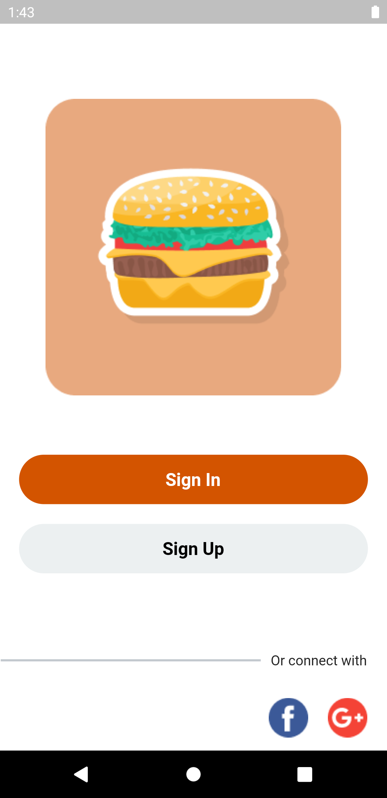
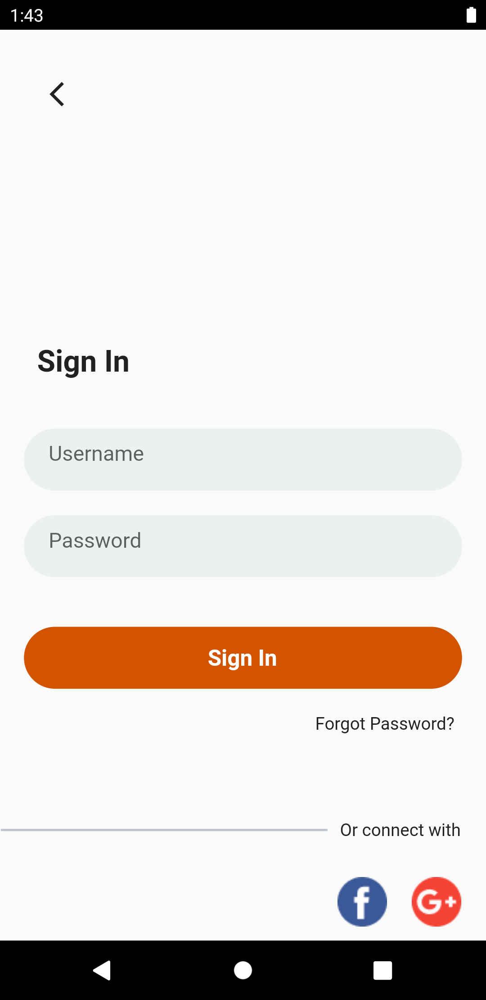
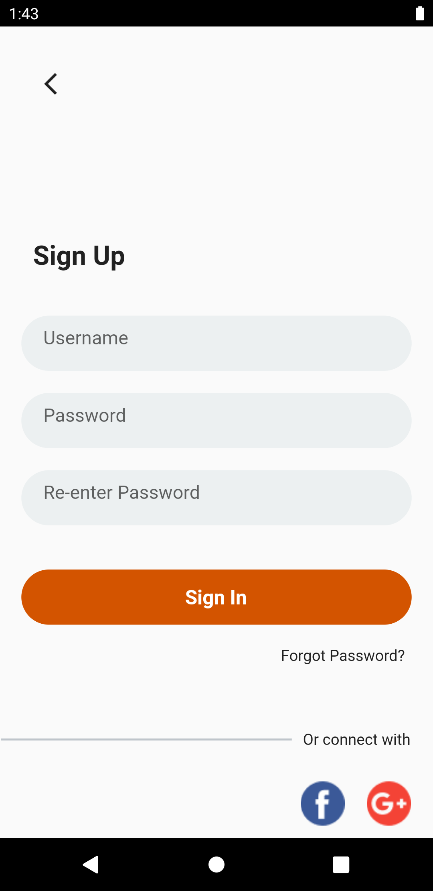
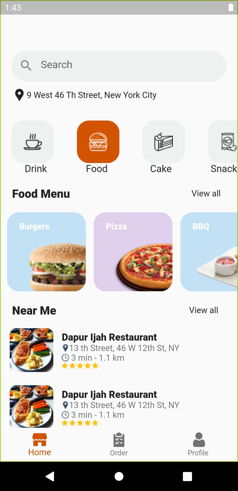
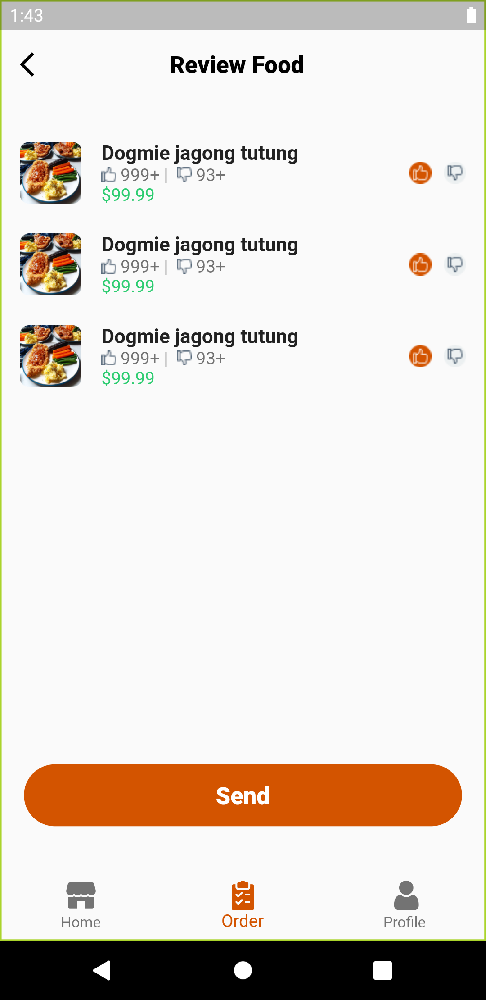
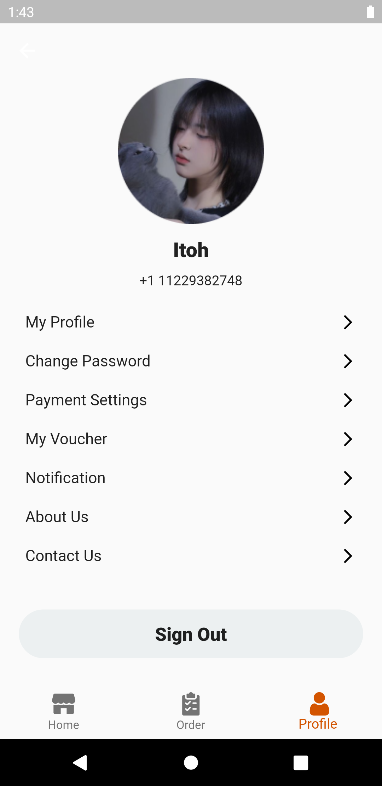

# project2

Hi everyone here is my second project at the Flutter bootcamp

ui Desin (Food Delivery_mobile app)
Which includes 6 screens:
1- GetStarted screen
2- Signin screen
3- Signup screen
4- Home screen
5- Order screen
6- Profile screen

1- GetStarted screen:Contains buttons to push (Signin\Signup)

2-Signin screen:

3-Signup screen

4-Home screen:Move across screens through NavigationBar

5-Order screen:

6-Profile screen:

